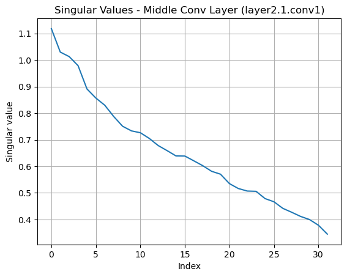
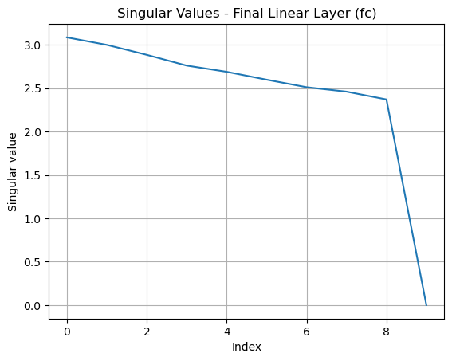
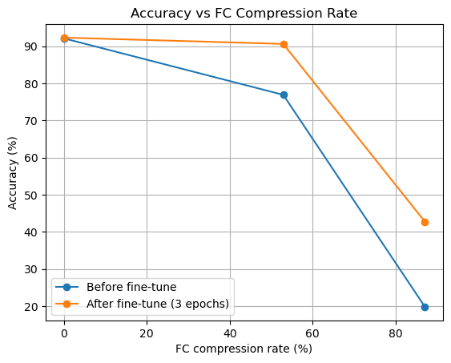

# Low-Rank Compression of ResNet-20 Using SVD

An academic computational data mining project investigating **low-rank compression of the final classifier** in a pretrained CIFAR-10 ResNet-20. The project analyzes weight spectra, replaces one linear layer with two smaller layers using singular value decomposition (SVD), and evaluates the effect of compression and classifier-only fine-tuning.

> Scope: only the **final fully connected (FC) layer** is compressed. The convolutional backbone is analyzed but is **not** compressed. Percentages below refer to the FC layer, not the entire network.

## Project at a glance

- **Model:** pretrained CIFAR-10 ResNet-20, loaded from the third-party [`chenyaofo/pytorch-cifar-models`](https://github.com/chenyaofo/pytorch-cifar-models) project via `torch.hub`.
- **Dataset:** CIFAR-10, using the 50,000-image training split for fine-tuning and the 10,000-image test split for evaluation.
- **Libraries:** Python, PyTorch, torchvision, NumPy, and Matplotlib.
- **Method:** SVD-based factorization of the last linear layer, followed by three epochs of classifier-only fine-tuning.

## Method

1. Load pretrained ResNet-20 and examine a middle convolutional weight tensor (reshaped to a matrix) and the final FC weight matrix.
2. Plot singular values and compute the rank required to retain 95% of the sum of squared singular values.
3. Factorize the original FC layer into `Linear(64, k, bias=False)` followed by `Linear(k, 10)`, retaining the original bias in the second layer.
4. Compare the unmodified model with two target compression settings, then fine-tune **only** the classifier layers for three epochs.
5. Measure CIFAR-10 test accuracy, parameter counts, and CPU inference latency.

## Results and figures from the submitted notebook

**Middle convolutional layer: singular values**



**Final FC layer: singular values**



**Accuracy versus FC compression, before and after fine-tuning**



The PNG files are extracted from the **saved outputs in the original notebook**; they were not recreated with new training runs.

## Saved notebook results

The following numbers are **transcribed from the notebook's saved execution output**, not independently reproduced on a new machine.

| Variant | Factorization rank | Final FC parameters | Actual FC parameter reduction | Accuracy before fine-tuning | Accuracy after 3 epochs |
| --- | ---: | ---: | ---: | ---: | ---: |
| Baseline | — | 650 | 0% | 92.12% | 92.31% |
| Moderate compression | 4 | 306 | 52.92% | 76.90% | 90.61% |
| Strong compression | 1 | 84 | 87.08% | 19.81% | 42.73% |

**Important:** the target labels “50%” and “80%” in the notebook are *requested reduction levels*. The actual FC reductions are **52.92%** and **87.08%**, respectively, because the implementation selects an integer rank.

### CPU timing in the saved notebook

The notebook measures **milliseconds per batch**, not milliseconds per image. The batch size is 256, except potentially the final partial batch.

| Variant | Mean CPU latency per batch (ms) | Standard deviation (ms) |
| --- | ---: | ---: |
| Baseline | 297.38 | 49.31 |
| Rank 4 | 300.73 | 53.67 |
| Rank 1 | 312.29 | 55.95 |

**This particular saved timing run does not demonstrate a CPU speedup.** Compressing a small FC layer can introduce overhead from two sequential linear operations. CPU timing is machine- and run-dependent; rerun the benchmark before drawing a general conclusion.

## Project structure

```text
.
├── README.md
├── LICENSE
├── requirements.txt
├── .gitignore
├── notebooks/
│   └── low_rank_resnet20_cifar10.ipynb
└── assets/
    ├── middle_conv_singular_values.png
    ├── final_linear_singular_values.png
    └── accuracy_vs_fc_compression.png
```

## How to run

1. Install Python 3 and open `notebooks/low_rank_resnet20_cifar10.ipynb` in Jupyter or Google Colab.
2. Install the packages listed in `requirements.txt` in your notebook environment.
3. Run the cells from top to bottom. The first run downloads the pretrained model and CIFAR-10; **internet access is required**.
4. Use the notebook's saved charts for a quick preview without rerunning the full experiment. Full training and repeated CPU measurements can take time.

```bash
pip install -r requirements.txt
```

**Working directory:** run the notebook with the repository root as the working directory if you want CIFAR-10 downloaded into `./data` at the repository root. If you launch Jupyter from inside `notebooks/`, its `./data` directory will instead be created there; both locations are excluded via `.gitignore`.

**Third-party material:** the pretrained model and CIFAR-10 data are fetched from their respective sources and are not distributed in this repository. Observe the terms of the model provider and dataset. The MIT license in this repository covers only the code and materials for which the repository owner has the right to grant that license.

## Documentation and reproducibility note

This repository presents the **notebook as the source of truth for saved experimental values**. An earlier Persian course report associated with this work contains different numbers for the intermediate convolutional rank, strong-compression rank/accuracy, and CPU latency. To avoid giving conflicting evidence, that report is **not bundled as a result source here**. If publishing it separately, first reconcile its tables and figures with a fresh reproducible notebook run.

The notebook was reorganized for presentation and existing output paths were sanitized; the training/compression algorithm was not changed and **was not rerun** while preparing this repository.

## License

MIT for original project code, once the copyright holder placeholder in `LICENSE` has been replaced. Third-party model and dataset terms remain separate.
